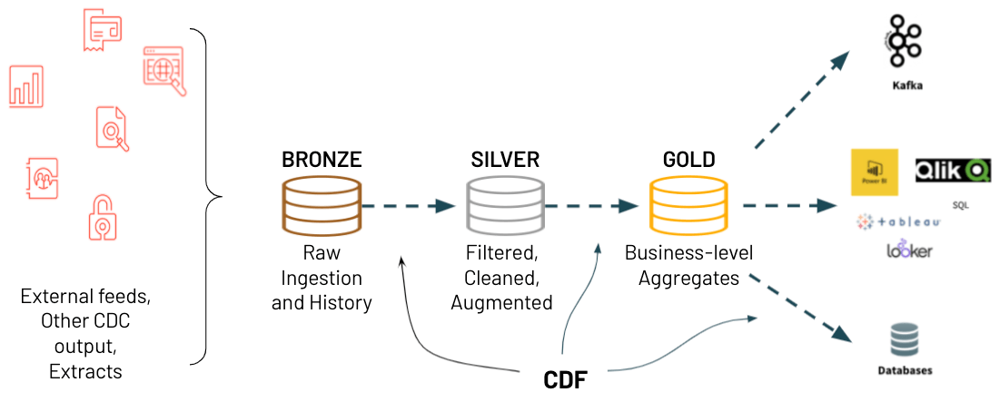

# Minimum Jazz

Minimum Jazz is a sample Apache Spark data engineering pipeline project.  There are two use cases demonstrated in this project.  The first one is to show best practices processing XML data using Apache Spark.  The second aim is apply a named entity recognizer (NER) as part of that data processing pipeline.  

## Prerequisites

Please read the [contributing guide](CONTRIBUTING.md) on how to set up your environment. 

## Data Generation Module

The XML data generation module uses the faker library and xml.etree Python library

```python
from jazz.data import generate

raw_path = "/dbfs/home/username/minimum_jazz/raw"
generate(raw_path, 10)
```
## Pipeline Module

The pipeline module facilitates processing the XML data according to the Medallion Architecture.  The medallion architecture takes raw data landed from source systems and refines the data through bronze, silver and gold tables. A table is a representation of data in a row/column format.  Developers can then use the various Spark API's to interact with the data. 



The optimal way of implementing the bronze, silver, and gold tables in the medallion architecture is to use Delta Lake.  Delta Lake is an open-source project that enables building a Lakehouse Architecture on top of existing storage systems.  
### to_bronze()

The to_bronze() method is responsible for reading data from an upstream data source and 

```python
from jazz.pipeline import to_bronze

bronze_df = to_bronze(spark, "dbfs:/home/scott.stafford@databricks.com/minimum_jazz/raw")
display(bronze_df)
```


